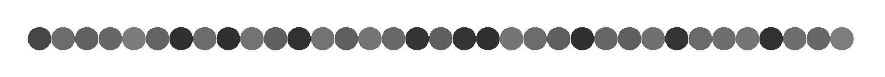

# [Circle Color](https://ctf.viblo.asia/puzzles/circle-color-bm3xn8jkcoy)

## [circle.zip]()

---

Sau khi giải nén folder zip. Mình được một bức ảnh các chấm tròn có các màu khác nhau:


Đề bài cũng đề cập về các màu sắc này. Mình đã sử dụng một [website](https://imagecolorpicker.com) để có thể kiểm tra các mã màu này. Mình thu được kết quả là:

```
#464646
#6c6c6c
#616161
#676767
#7b7b7b
```

Có thể nhận ra đây là các mã hex. Mình kiểm tra đến cuối rồi decode thì nhận được flag.

**Flag{c0l0r_1s_th3_50ul_0f_p4int1ng}**
