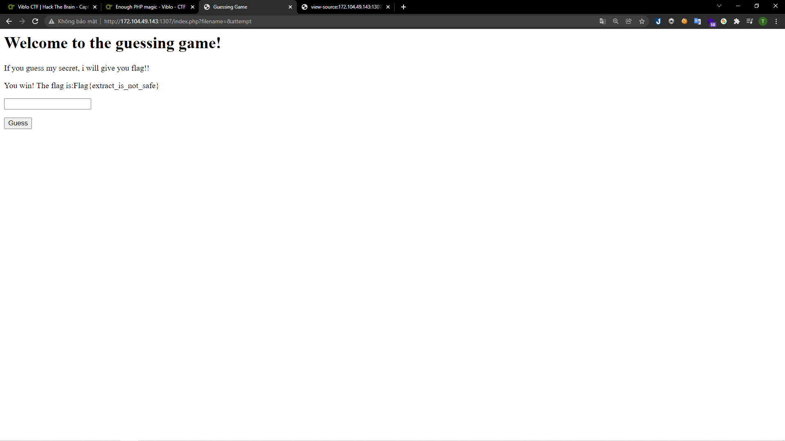

# [Enough PHP magic](https://ctf.viblo.asia/puzzles/enough-php-magic-qtd1odoekwl)

> http://172.104.49.143:1307

---

Mình vào đường dẫn. Nhập bất kì vào trường input thì nhận được thông báo lỗi. Đồng thời trên url cũng được truyền vào param `attempt`

Mình kiếm tra source code cũng không thấy lộ điều gì. Và sau khi thử quét các path ẩn thì mình thu được đường dẫn `index.phps`:

Giờ mình sẽ tìm ra lỗ hổng trong source code này.
Mình nhận thấy hàm extract ở đây được dùng khá lạ. Extract sẽ nhận vào một mảng, tách mảng đó theo 'key' để tạo ra biến tương ứng.

Mình đã nghĩ đến việc truyền vào nhiều hơn một param vì mình thấy `$filename` được khởi tạo trước khi extract đồng thời `$attempt` được so sánh với `xxxxxxxx.txt` chứ không phải `$filename` dù trước đó 2 giá trị này được gán bằng nhau.

Mình đã truyền cho `$_GET[]` 2 param rỗng là `filename` và `attempt`. Vì nếu `filename` mình truyền vào rỗng thì `$filename` rỗng, từ đó `$combination` cũng rỗng và điều kiện `$attempt === $combination` được thỏa mãn.
Mình truyền 2 param rỗng ở trang gốc:

> http://172.104.49.143:1307/?filename&attempt

Và kết quả mình thu được:

> 

Và thu được flag:

**Flag{extract_is_not_safe}**
