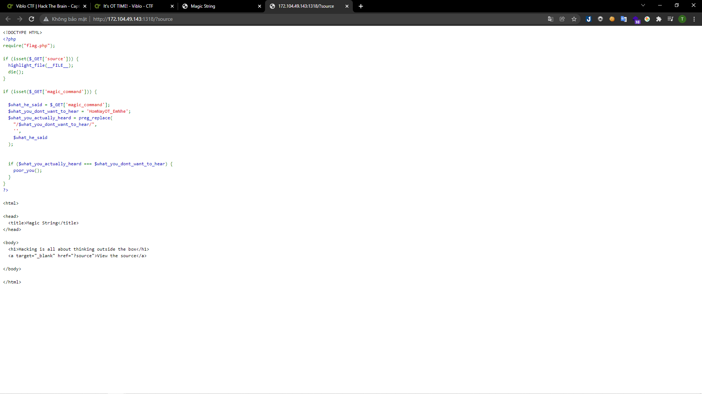
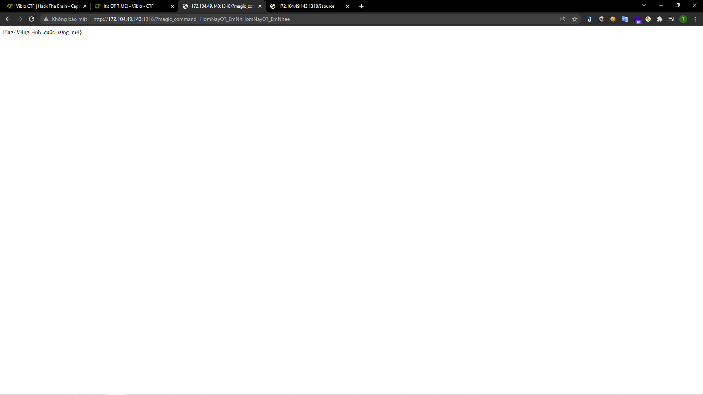

# [It's OT TIME!](https://ctf.viblo.asia/puzzles/it-s-ot-time-pofkh4esw6w)

> http://172.104.49.143:1318

---

Đi theo đường dẫn thì mình thấy được source code của bài này:

> 

Source code này yêu cầu mình truyền param `magic_command`. Đồng thời sẽ loại bỏ toàn bộ cụm `HomNayOT_EmNhe` bằng hàm `preg_replace`. Sau cùng nếu như kết quả thu về sau khi xóa bỏ vẫn có cụm `HomNayOT_EmNhe` thì sẽ nhận được flag.

Mình nhận thấy lỗ hổng là ở việc hàm `preg_replace` sẽ kiểm tra lần lượt từ đầu đến cuối mà không hề kiểm tra lại chuỗi sau khi thay thế. Nên mình chỉ việc chèn vào giữa cụm `HomNayOT_EmNhe` một cụm giống hệt. Ví dụ như: `HomNayOT_EmNhHomNayOT_EmNhee`. Bằng cách đó mình thêm vào param `magic_command`:http://172.104.49.143:1318/?magic_command=HomNayOT_EmNhHomNayOT_EmNhee là có được flag:

> 

**Flag{V4ng_4nh_cu0c_s0ng_m4}**
