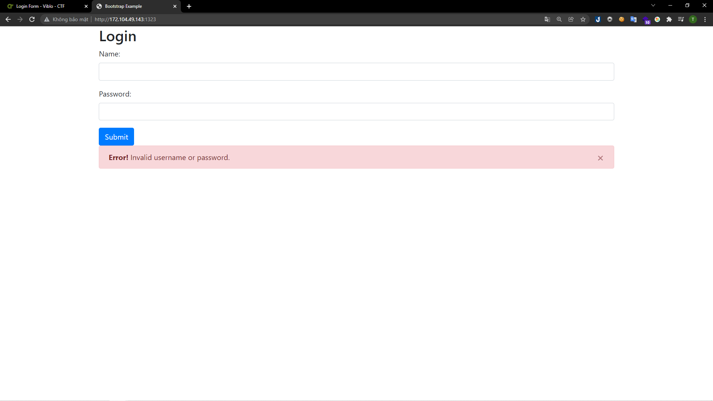
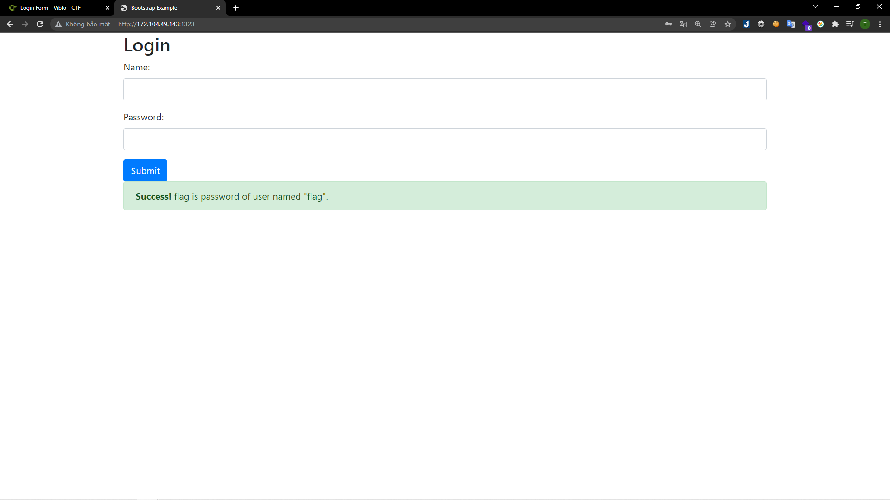
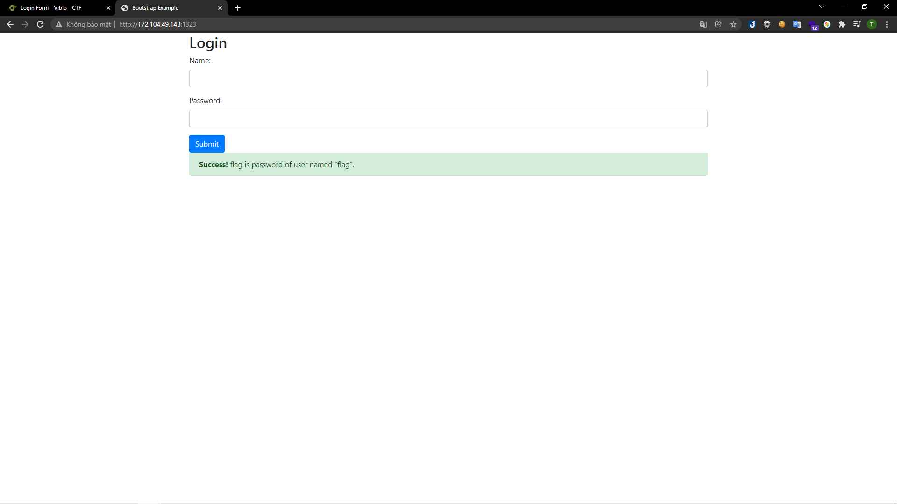

# [Login Form](https://ctf.viblo.asia/puzzles/login-form-ebfvssjqfr5)

> http://172.104.49.143:1323

---

Mình nhận được một form login. Mình nhập thử một tài khoản bất kì thì nhận được thông báo sai thông tin:

> 

Sau đó mình thử sqli tài khoản `admin` bằng payload `admin' OR 1=1-- -` thì thanh thông báo đã thay đổi:

> 

Đã có thông báo thành công. Tuy nhiên yêu cầu là lấy thông tin của user `flag` nên mình đã đổi payload thành `flag' OR 1=1-- -` tuy nhiên thông báo vẫn không đổi:

> 

Mình đã chuyển sang kali để chạy tool sqlmap. Vì là sqliblind nên tốn khá nhiều thời gian. Nhưng mình cũng thu được flag.

**Flag{Bl1nd_Sql_Inj3cti0n_V3ry_3asy}**
