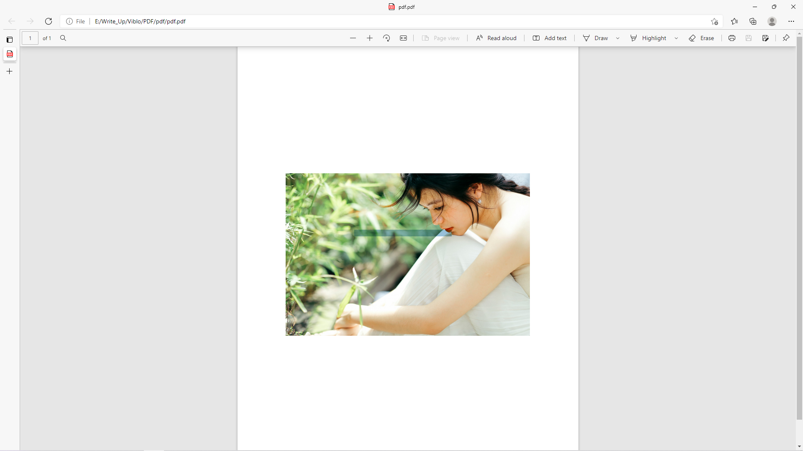

# [PDF](https://ctf.viblo.asia/puzzles/pdf-m6w6gidsrpl)

> [pdf.zip](pdf.zip)

Sau khi giải nén mình được một file PDF. Sau đó mình ctrl+A thì thấy phần giữa ảnh giống như có một đoạn text bị ẩn đi.

> 

Mình đã copy và paste thử. Và nhận được flag.

**flag{easy_show_flag_pdf_to_word}**
