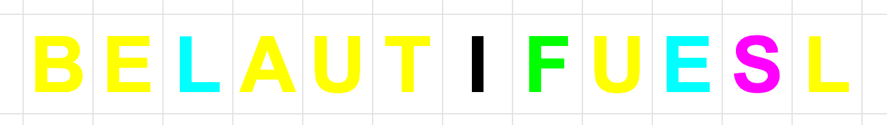
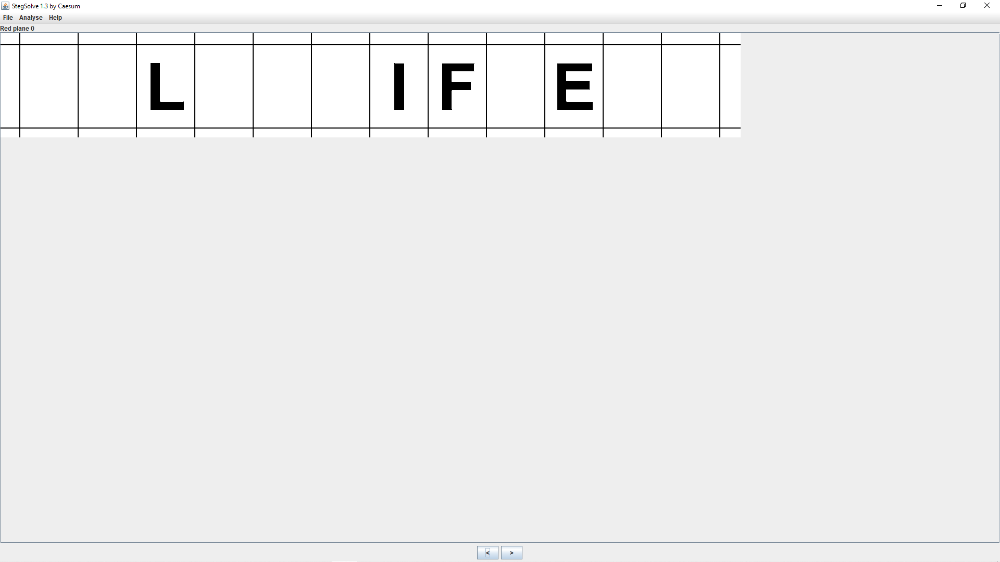
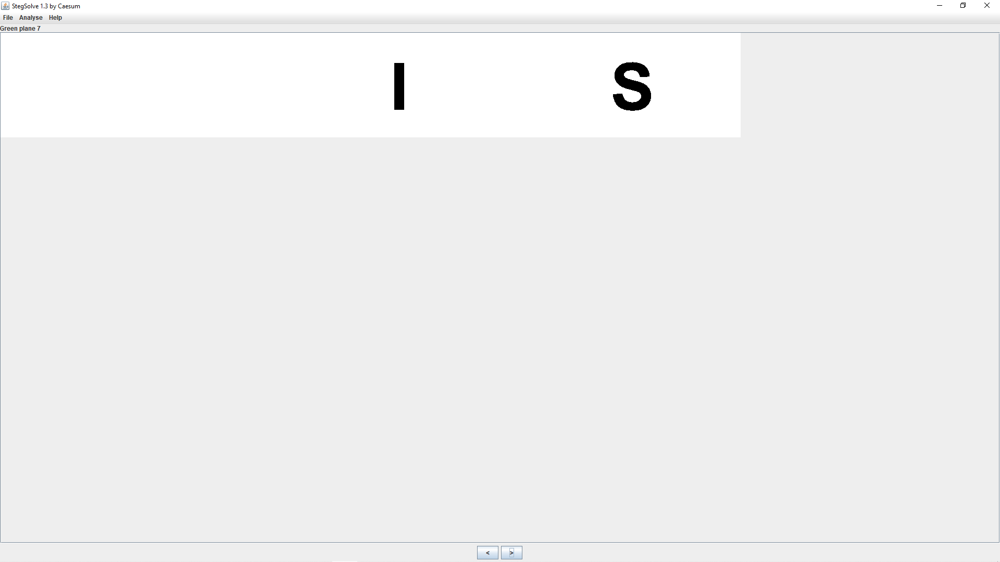
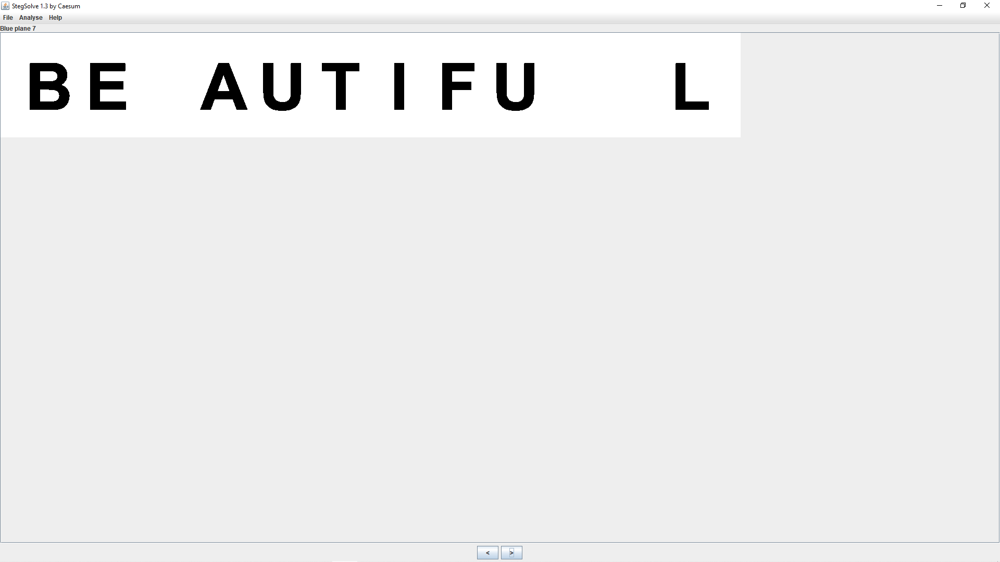

# [RGB Sun Glasses](https://ctf.viblo.asia/puzzles/rgb-sun-glasses-w2mhzjsdl5g)

> 

---

Đề bài cho mình một bức ảnh. Nhận thấy màu sắc khá là lộn xộn, nên mình đã sử dụng công cụ `stegsolve` để lọc các plane màu. Và kết quả mình thu được 3 plane màu tương ứng với các từ của flag:

>   

**Flag{LIFEISBEAUTIFUL}**
