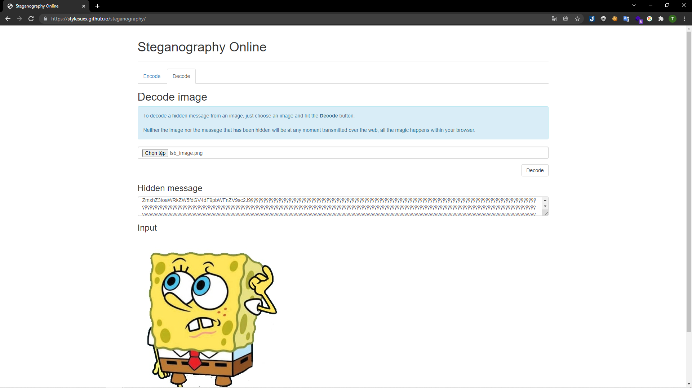
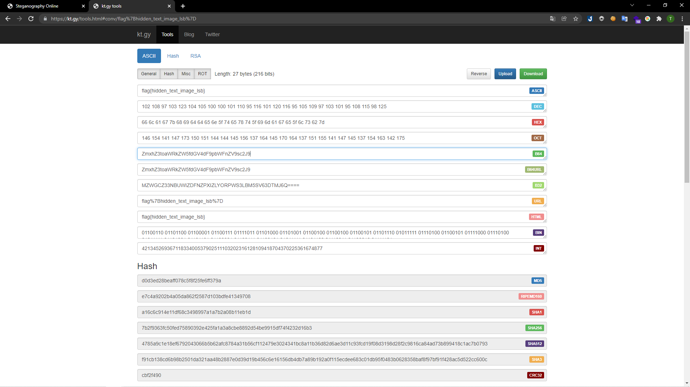

# [Spongebob Spongebob](https://ctf.viblo.asia/puzzles/spongebob-spongebob-f6zdxekrcdy)

> 

---

Mình giải nén và nhận được một hình ảnh, bức ảnh này mình thử phân tích qua khá nhiều công cụ nhưng không nhận được kết quả như ý. Sau đó mình mới nhìn tên file:

> 

Mình đã có tìm hiểu về kĩ thuật giấu tin lsb. Mình tìm được trang web decode những ảnh như thế: `https://stylesuxx.github.io/steganography`. Sau đó mình tải lên hình ảnh:

> 

Thu được đoạn mã: `ZmxhZ3toaWRkZW5fdGV4dF9pbWFnZV9sc2J9`

Decode base64 và mình nhận được flag:

> 

**flag{hidden_text_image_lsb}**
