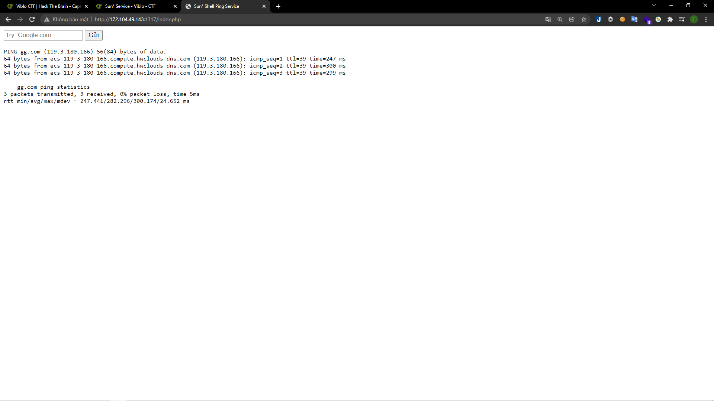
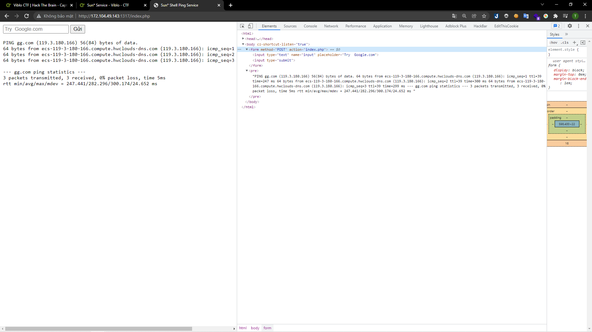
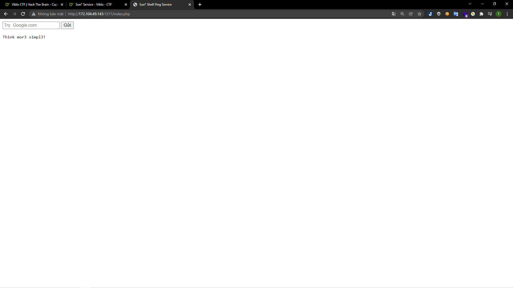
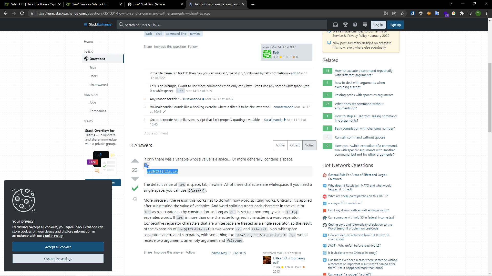
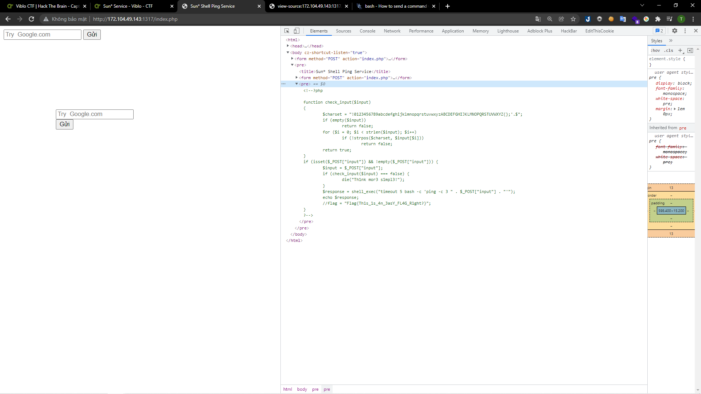

gg.com

# [Sun\* Service](https://ctf.viblo.asia/puzzles/sun-service-knjw1vcjylx)

> http://172.104.49.143:1317

---

Trang web này yêu cầu mình nhập vào địa chỉ bất kì. Mình nhập thử địa chỉ `gg.com`

> 

Có thể thấy đây là một câu lệnh ping.

> 

Mình kiểm tra source code thì thấy form này gửi POST data về cho chính nó, tức file `index.php` nên mình tìm các để đọc nội dung file này. Mình thử với câu lệnh `cat`: `;cat index.php`

> 

Có vẻ mình đã đi đúng hướng. Tuy nhiên câu lệnh trên có vẻ không được chấp thuận. Mình mày mò và biết được là do kí tự `' '`. Mình tra google và ra được cách bypass kí tự `' '`:

> 

Mình thay đổi payload thành `;cat${IFS}index.php` và ra được flag:

> 

**Flag{Th1s_1s_4n_3asY_FL4G_R1ght?}**
