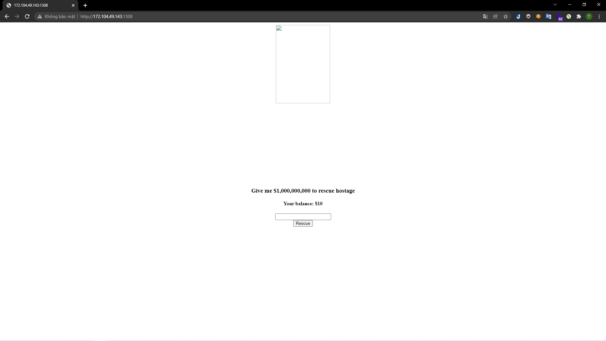
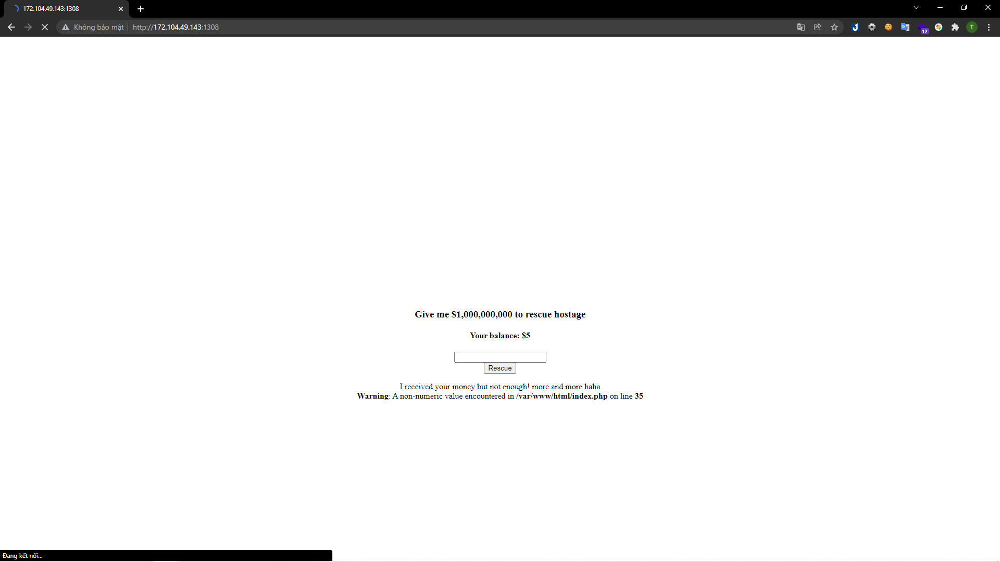
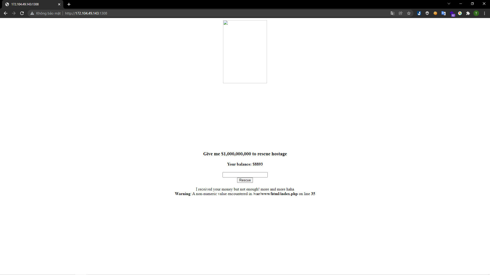
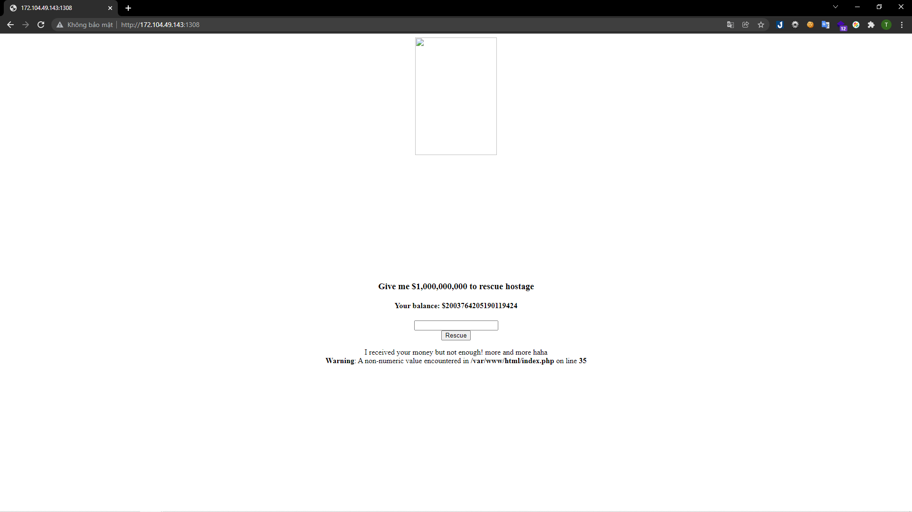
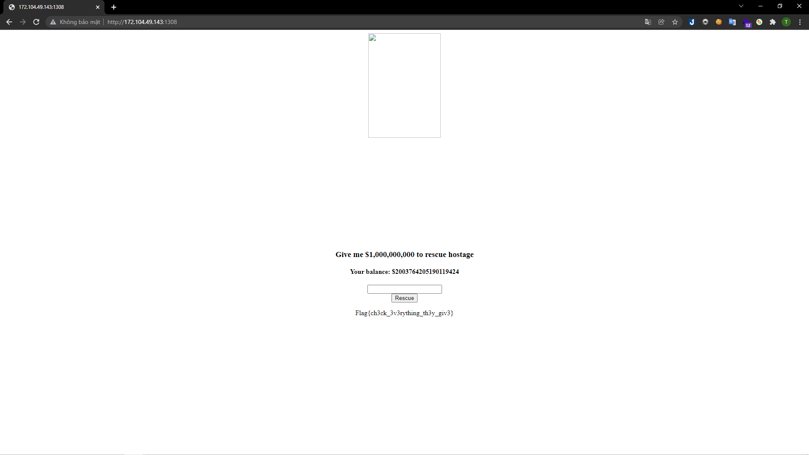

# [We're out of idea, let's call it Web2](https://ctf.viblo.asia/puzzles/we-re-out-of-idea-let-s-call-it-web2-hlygivzyghj)

## http://172.104.49.143:1308

---

Mình nhận được một form yêu cầu nhập số tiền để lấy flag:

> 

Số tiền cần lớn hơn rất nhiều so với số tiền mình có. Mình vẫn nhập thử một số tiền nhỏ, mình nhập `2`:

> 

Số tiền còn lại đúng với số dư sau khi trừ đi. Nên mình mới thử nhập một số âm:

> 

Kết quả thì số tiền lại tăng lên do phép trừ được thực hiện. Mình đã nhập một só âm lớn hơn rất nhiều so với yêu cầu để tài khoản dư tiền:

> 

Sau khi số dư đã đủ thì mình nhập số tiền mà đề bài yêu cầu và có được flag:

> 

**Flag{ch3ck_3v3rything_th3y_giv3}**
