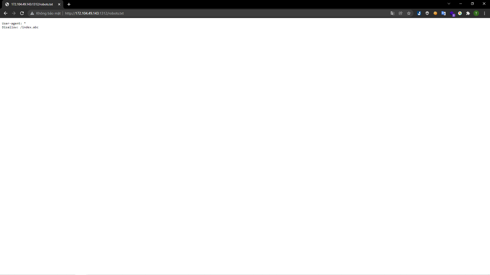

# [Web7](https://ctf.viblo.asia/puzzles/web7-qwevvyc7qkq)

> http://172.104.49.143:1312

---

Mình nhận được một đường dẫn. Kiểm tra source thì không thấy có gì đặc biệt:

> 

Khi vào đường dẫn `robots.txt` thì mình nhận được một đường dẫn `disallow` là `index.abc`:

> 

Mình vào đường dẫn đó thì thấy được đoạn code:

> 

Đoạn code này yêu cầu mình truyền vào 1 param `password`. Hàm `ereg` dùng để kiểm tra dữ liệu truyền vào có phải chỉ gồm các chữ cái và số không. Tuy nhiên sau đó lại yêu cầu giá trị param `password` lại cần có `^_^` nên mình nghĩ bài này yêu cầu khai thác vào cách bypass hàm `ereg`. Mình tra google xem có cách nào bypass hàm này không. Và kết quả mình tìm được một bài viết nói về việc này:

> 

Truyền vào param với NULL byte: http://172.104.49.143:1312/?password=aaaa%00^_^ mình thu được flag:

> 

**Flag{POISON_NULL_BYTE}**
